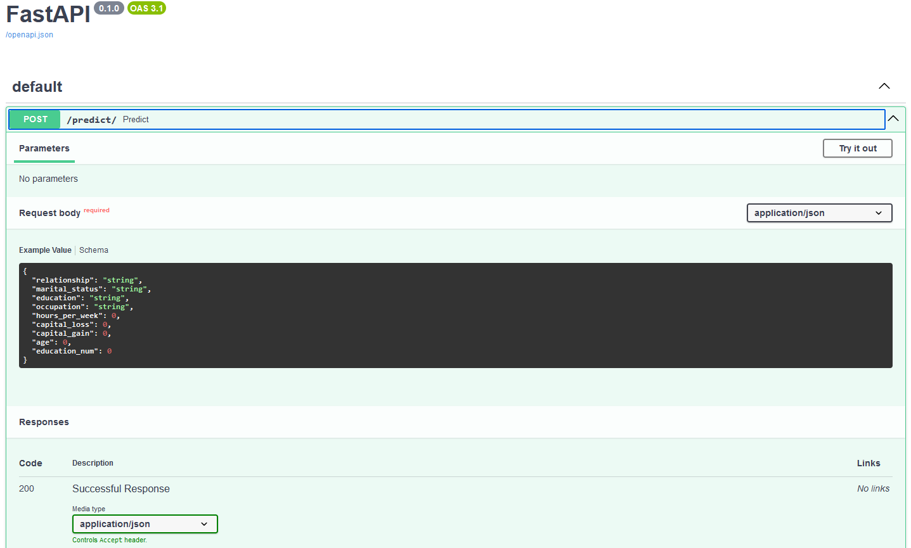
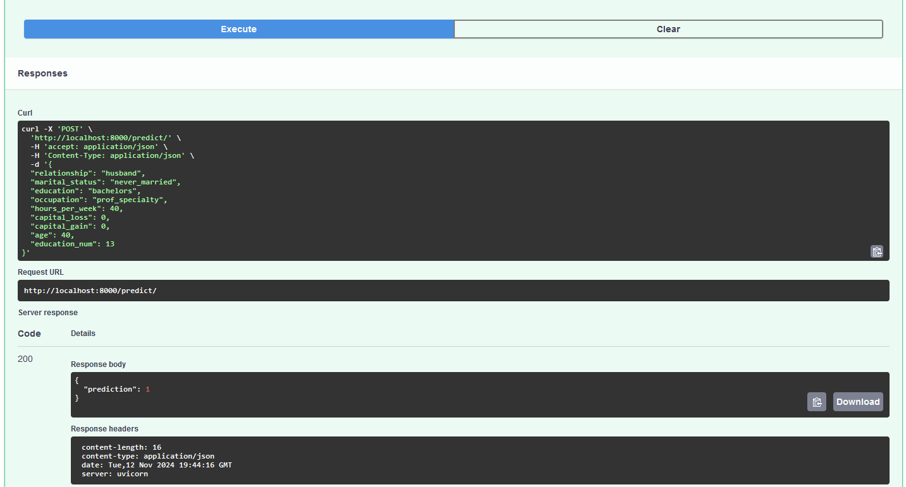
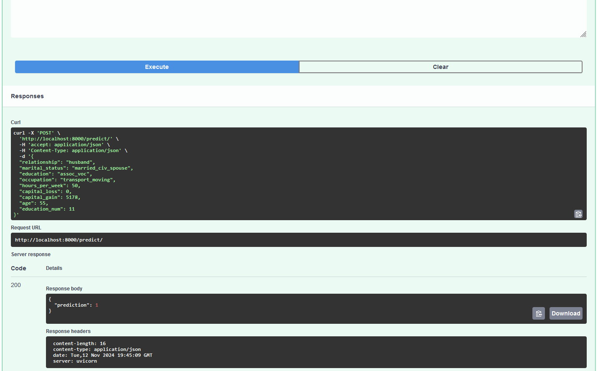

# Salary Prediction - ML Midterm Project, 2024 cohort
## Overview
This is a Classification Machine Learning project completed as part of the certification for the DataTalks Machine Learning Zoomcamp, 2024 cohort. The project aims to predict individuals who earn more than 50,000 dollars per year based on a variety of features. Although the dataset is outdated, it served the purpose of demonstrating our competency in data analysis, preparing data for machine learning operations, and deployment.

The project includes a notebook file, named notebook.ipynb, which covers data cleaning, exploratory data analysis (EDA), preprocessing, model training, and validation. Additionally, there are two Python scripts: `train.py` that encompasses all the necessary steps to train the model, and `predict.py`, designed for making predictions on new data. Finally, a Dockerfile is included for containerizing the project. The dependencies and packages are managed using Poetry.

### **Disclaimer for the evaluation of this project**
We tried to follow the steps from each of the lessons, but we made some modifications because I was looking for an opportunity to experiment with different technologies and steps, and the project turned out to be the ideal opportunity for that. Below are the most important modifications:

1. Instead of Pipenv, Poetry was used here, and all the main files are inside the midterm_project folder. Therefore, instead of `Pipfile` and `Pipfile.lock`, this project has the `pyproject.toml` and `poetry.lock` files.
2. Instead of transforming lists of feature-value mappings to vectors with `DictVectorizer`, we applied different types of encodings using the `pipeline` function from scikit-learn as a way to keep all dataset transformations organized.
3. The entire parameter evaluation and Cross-Validation were performed using a single scikit-learn function called `GridSearchCV`, so we kept the instructions but used different methods.
4. For the web framework, instead of Flask, FastAPI was used, which, along with Swagger UI, made API building and documentation more convenient.

## Dataset
This dataset was found on Kaggle and is called "Salary Prediction Classification". It can be found here: [https://www.kaggle.com/datasets/ayessa/salary-prediction-classification/data](https://www.kaggle.com/datasets/ayessa/salary-prediction-classification/data). The .csv file is located in the [data](./midterm_project/data) folder under the name [salary.csv](./midterm_project/data/salary.csv). Unfortunately, there is no extensive description, but we know that the data was extracted from a 1994 census. The column descriptions only state that the numerical data is continuous and provide the categorical features, but we don't have more information about some of these features:

### Numerical Features
All continuous values:
- age
- education-num
- fnlwgt
- capital-gain
- capital-loss
- hours-per-week

### Categorical Features
- workclass: Private, Self-emp-not-inc, Self-emp-inc, Federal-gov, Local-gov, State-gov, Without-pay, Never-worked.
- education: Bachelors, Some-college, 11th, HS-grad, Prof-school, Assoc-acdm, Assoc-voc, 9th, 7th-8th, 12th, Masters, 1st-4th, 10th, Doctorate, 5th-6th, Preschool.
- marital-status: Married-civ-spouse, Divorced, Never-married, Separated, Widowed, Married-spouse-absent, Married-AF-spouse.
- occupation: Tech-support, Craft-repair, Other-service, Sales, Exec-managerial, Prof-specialty, Handlers-cleaners, Machine-op-inspct, Adm-clerical, Farming-fishing, Transport-moving, Priv-house-serv, Protective-serv, Armed-Forces.
- relationship: Wife, Own-child, Husband, Not-in-family, Other-relative, Unmarried.
- race: White, Asian-Pac-Islander, Amer-Indian-Eskimo, Other, Black.
- sex: Female, Male.
- native-country: United-States, Cambodia, England, Puerto-Rico, Canada, Germany, Outlying-US(Guam-USVI-etc), India, Japan, Greece, South, China, Cuba, Iran, Honduras, Philippines, Italy, Poland, Jamaica, Vietnam, Mexico, Portugal, Ireland, France, Dominican-Republic, Laos, Ecuador, Taiwan, Haiti, Columbia, Hungary, Guatemala, Nicaragua, Scotland, Thailand, Yugoslavia, El-Salvador, Trinadad&Tobago, Peru, Hong, Holand-Netherlands.

### Target Feature
- salary: <=50K or >50K

## [Notebook](./midterm_project/notebook.ipynb)
**1. Data Preparation & Reading**:
The dataset was read using pandas and thoroughly examined. Columns were standardized, and the data was properly formatted. Missing and duplicate values were checked and removed. Initially, missing values were represented as "?", but these were replaced with NaN and subsequently dropped. The target variable was analyzed for class imbalance and encoded as 0 for "<50K" and 1 for ">=50K." Finally, the data was split into training, test, and validation sets.

**2. Exploratory Data Analysis**:
Missing values were checked again. Feature importance analysis was conducted, focusing on the target variable (salary). Both numerical and categorical variables were explored separately. Categorical features were examined in relation to the salary rate difference and mutual information. Numerical features were explored using various graphs to understand their distribution, frequency, and correlation.

**3. Model Selection**:
Using the `Pipeline` function, the most relevant categorical and numerical columns were selected. Categorical features were encoded using `OneHotEncoder`, `OrdinalEncoder`, and `TargetEncoder`. Due to the presence of significant outliers in the numerical features, they were scaled using `RobustScaler`. The preprocessor applied these transformations to two models: Random Forest and XGBoost. Cross-validation was conducted, and the best parameters were identified using `GridSearchCV`. Ultimately, a tuned XGBoost model achieved the highest F1 and ROC scores. Because the target feature were imbalanced, it was possible to adjust the weights on both the Random Forest and XGBoost. On Random Forest, we flaged the parameter `class_weight=balanced` and for XGBoost, we had to calculate manually the `scale_pos_weigth` as follows:

`scale_pos_weight = (n examples from majority class) / (n examples from minority class)`

**4. Model Saving and Loading**:
Both the model and the preprocessor were saved together in a single pickle file for easy reuse. This file was then loaded to demonstrate an example of how predictions can be made using the saved model and preprocessing pipeline.

## Scripts
### [train.py](./midterm_project/train.py)
This file is responsible for training an XGBoost model to predict salary classes based on several features, with steps for data preprocessing, hyperparameter tuning, and saving the final model along with its preprocessor.

First, the data is loaded from a .csv file, cleaned, and prepared by transforming columns to lower case and removing missing or duplicate entries. The target variable (salary) is encoded into binary values, where >50k is marked as 1 and <=50k as 0. The data is split into training, validation, and test sets to allow model training and evaluation.

For preprocessing, the code defines separate transformations for categorical and numerical columns. Categorical variables such as "relationship" and "marital status" are encoded using a combination of `OneHotEncoder`, `OrdinalEncoder` (for "education"), and `TargetEncoder`, while numerical features like age and capital gains are scaled using `RobustScaler` to manage outliers effectively. These transformations are then bundled into a preprocessing pipeline.

The model is trained using XGBoost with `GridSearchCV`, which tests different combinations of hyperparameters (like n_estimators, max_depth, learning_rate, etc.) to identify the best configuration based on ROC AUC score. The pipeline integrates both preprocessing and model training steps, ensuring that all data transformations are applied consistently.

After training, the best-performing model and preprocessor are saved together using pickle, enabling future use for predictions. The main function orchestrates the process, training the model, evaluating it on the test data, and saving the final model.

### [predict.py](./midterm_project/predict.py)
The predict.py code is designed to deploy the trained XGBoost model as an API using FastAPI. The script loads the trained model and the preprocessor from a previously saved pickle file, which allows it to make predictions on new data inputs.

First, the model and preprocessor are loaded into memory. The FastAPI framework is then used to define an API endpoint that receives prediction requests. The input data model is defined using the `BaseModel` class from Pydantic, which specifies the required fields (e.g., relationship, education, hours per week) along with their data types. This structure ensures that the incoming data matches the expected format for making predictions.

When a POST request is made to the `/predict/` endpoint, the input data is converted into a pandas DataFrame. This input is then passed to the loaded model (which already includes the necessary preprocessing steps) to generate a prediction. Finally, the predicted salary class (either 0 or 1) is returned in the response.

This setup allows the model to be served as an API, providing predictions based on new data in real time with FastAPI and Uvicorn.

## Dependencies Files
As the entire project was developed using Poetry, two key dependency files were included: pyproject.toml and poetry.lock. These files play an essential role in ensuring that all necessary libraries, packages, and dependencies are installed correctly, allowing the project to run smoothly.

- **pyproject.toml**: This file defines the project’s metadata, dependencies, and configuration. It lists all the packages required for the project, including their version constraints. When you run poetry install, Poetry reads this file to determine which packages need to be installed.

- **poetry.lock**: This file records the exact versions of all installed dependencies and their sub-dependencies, ensuring consistency across different environments. By using the poetry.lock file, you can guarantee that anyone installing the project’s dependencies will get the same versions that were used during development, preventing potential compatibility issues.

Together, these files allow anyone to recreate the same development environment, ensuring the project’s reproducibility and smooth operation. Running `poetry install` from the project's root directory ensures that all necessary dependencies are installed, matching the exact versions defined in the lock file.

## Dockerfile
Additionally, a Dockerfile was created to containerize the project, ensuring that the entire application can run in an isolated environment, providing a consistent runtime environment whether it's on a local machine, in testing, or production.

To install and run the application using Docker, use the following commands to build the Docker image and run it, exposing the FastAPI app on port 8000 after having docker running properly:

    docker build -t midterm-fastapi-app .
    docker run -d -p 8000:8000 midterm-fastapi-app

## Deployment

The model was deployed locally using FastAPI, but it can be easily scaled to a cloud service. SwaggerUI was used to test and interact with the model. When running locally, with the help of the Dockerfile, SwaggerUI can be accessed at: http://localhost:8000/docs.

### Examples of use

Below is the layout when accessing SwaggerUI.

You can select the `Try it out` button and enter new information, and the body will return the prediction.

Like in this example:
{
  "relationship": "husband",
  "marital_status": "never_married",
  "education": "bachelors",
  "occupation": "prof_specialty",
  "hours_per_week": 40,
  "capital_loss": 0,
  "capital_gain": 0,
  "age": 40,
  "education_num": 13
}

Or this example:
{
  "relationship": "husband",
  "marital_status": "married_civ_spouse",
  "education": "assoc_voc",
  "occupation": "transport_moving",
  "hours_per_week": 50,
  "capital_loss": 0,
  "capital_gain": 5178,
  "age": 55,
  "education_num": 11
}

## Conclusion:
This project provides a foundation for salary prediction using machine learning, but there are several areas where improvements can be made. 
For example, the missing data could be handled more effectively using imputation techniques like K-Nearest Neighbors (K-NN). 

Additionally, the encoding strategies could be further refined, as the choice of encoders may significantly impact model performance. 
It's also possible that RobustScaler is not the optimal choice for scaling the numerical features, especially given the presence of numerous outliers in the dataset.
Maybe spending more time cleaning the outliers values would bring benefits to the modedl. 
By addressing these aspects, better metrics and more accurate predictions could be achieved.